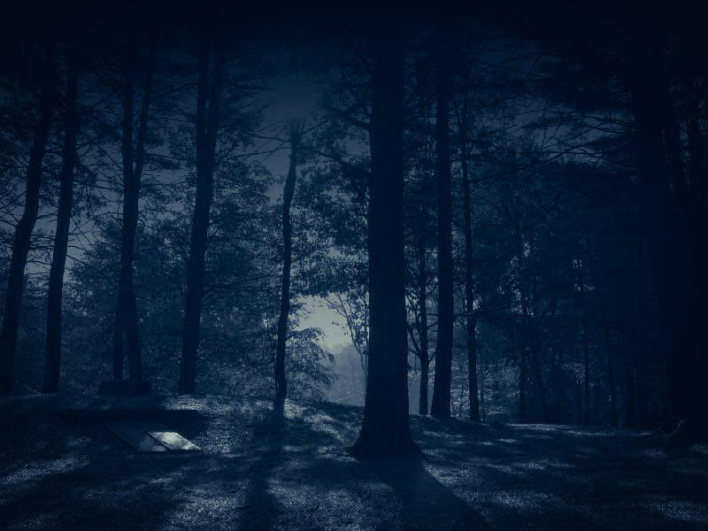
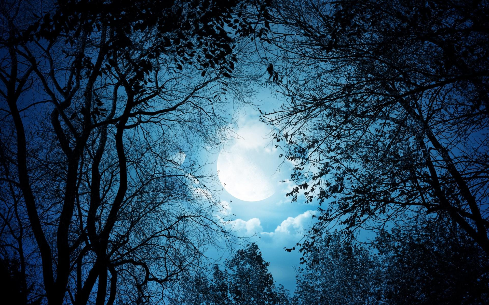

# How to find if an image is bright or dark?
### Concept

- Input image is resized to `10x10` pixel, to reduce the computation.
- Convert it to `LAB` color space to access the luminous channel which is independent of colors.
- Normalize pixel values to be in range of `0 - 1`.
- Compare the `mean` value of pixels with an `threshold` value.

### External modules

```
>> pip install opencv-python
>> pip install numpy
```
### How to run

- **Demo**: [Colab Notebook](https://colab.research.google.com/github/imneonizer/How-to-find-if-an-image-is-bright-or-dark/blob/master/demo.ipynb)

- **Execute program**

  ````
  python run.py
  ````

  - It will read images from `images` directory and classify it as bright or dark.
  - It will separate and save images to  `output/bright` directory and `output/dark` directory accordingly.

- **Sample Dark Images**

  <table>
      <tr>
          
          
      </tr>
  </table>

- **Sample Bright Images**

  <table>
      <tr>
          
          
      </tr>
  </table>

- The function calculate brightness level in range of 0-1, hence you can decide on a threshold to treat images either as bright or dark.

  ````python
  def isbright(image, dim=10, thresh=0.5):
      # Resize image to 10x10
      image = cv2.resize(image, (dim, dim))
      # Convert color space to LAB format and extract L channel
      L, A, B = cv2.split(cv2.cvtColor(image, cv2.COLOR_BGR2LAB))
      # Normalize L channel by dividing all pixel values with maximum pixel value
      L = L/np.max(L)
      # Return True if mean is greater than thresh else False
      return np.mean(L) > thresh
  ````

- For a better result you can tweak with `dim` parameter, it will preserve more pixels while calculating brightness levels.

- Don't forget to star the repository.

